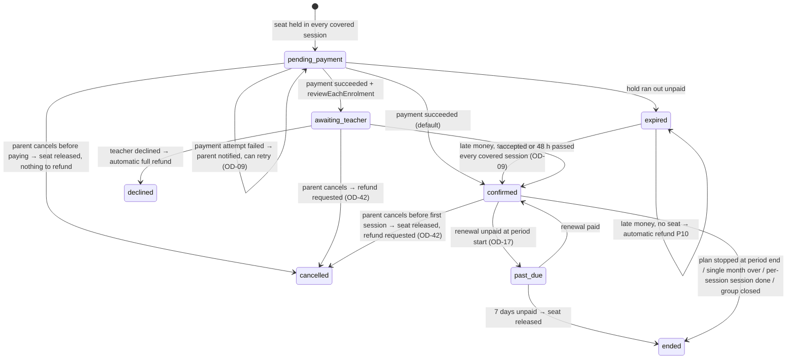

# 08 · Payments and ledger

Every payment goes through Link (BR-MNY-01). Money is integer piasters (ADR-0002). Every money event posts **one balanced ledger transaction** and has an idempotency key. Ledger data, payment status and consent are never cached.

Diagrams (Eraser): **05** Reservation & payment and **06** Rent, Link fees & payouts. IDs are in the [README](../README.md).

---

## 1. Chart of accounts

Accounts are created on demand. The code pattern is `<type>:<owner>`.

| Account | Type | Normal side | Meaning |
|---|---|---|---|
| `provider_clearing:{provider}` | asset | debit | Money the payment provider holds for Link: captured, not yet settled to our bank |
| `bank:link` | asset | debit | Link's settlement bank account |
| `teacher_pending:{teacherId}` | liability | credit | Teacher money held until release (BR-REF-01) |
| `teacher_available:{teacherId}` | liability | credit | Teacher money that can be paid out |
| `centre_available:{centreId}` | liability | credit | Net rent owed to the centre |
| `payouts_in_transit:{provider}` | liability | credit | Payouts sent but not yet confirmed |
| `refunds_in_transit:{provider}` | liability | credit | Refunds sent but not yet confirmed |
| `link_revenue:booking_commission` | revenue | credit | Revenue line 2 |
| `link_revenue:rent_fee` | revenue | credit | Revenue line 1 |
| `link_revenue:subscriptions` | revenue | credit | Revenue line 3 (unused until OD-05) |
| `link_expense:provider_fees` | expense | debit | Processing fees (Link pays them, OD-15) |
| `link_expense:chargeback_losses` | expense | debit | Chargebacks Link could not recover (OD-18) |

**Balance of a credit-normal account** = Σ credit − Σ debit. **Balance of a debit-normal account** = Σ debit − Σ credit. Balances are computed from `ledger_entries`; they are never stored by hand and never cached.

## 2. Posting rules

Each row is one `ledger_transactions` row. Its entries always balance (INV-01). Amounts use **Example B** from [01-business-rules.md](01-business-rules.md) §13: monthly fee EGP 550, 5% commission, rent = 20% of fees, 5% rent fee.

### P1 · Payment captured (reservation or renewal)
Trigger: a verified `payment.succeeded` webhook. Idempotency key: `capture:{provider}:{providerRef}`.

| Account | Debit | Credit |
|---|---|---|
| `provider_clearing:paymob` | 55,000 | |
| `link_revenue:booking_commission` | | 2,750 |
| `teacher_pending:{teacher}` | | 52,250 |

`commission = floor(55,000 × 5.00 / 100) = 2,750` (BR-FEE-04). The rate and rule ID are snapshotted on the payment.

### P2 · Funds released
Trigger: a job that runs every 15 minutes. It releases a payment when its enrolment is `confirmed` **and** the first session of the paid period has started (OD-11). Key: `release:{paymentId}`.

| Account | Debit | Credit |
|---|---|---|
| `teacher_pending:{teacher}` | 52,250 | |
| `teacher_available:{teacher}` | | 52,250 |

### P3 · Rent deduction
Trigger: a rent invoice is issued (BR-RNT-05). The deduction is `min(gross, teacher available)`. Key: `rent-deduct:{rentInvoiceId}`.

Example B: rent 11,000; fee 5% = 550.

| Account | Debit | Credit |
|---|---|---|
| `teacher_available:{teacher}` | 11,000 | |
| `centre_available:{centre}` | | 10,450 |
| `link_revenue:rent_fee` | | 550 |

### P4 · Rent top-up (shortfall paid by the teacher)
Trigger: `payment.succeeded` for a `rent_topup` payment. Key: `capture:{provider}:{providerRef}`.

Example E: invoice 200,000; 120,000 deducted in P3 (fee share 6,000); shortfall 80,000. The last part takes the remaining fee: 10,000 − 6,000 = 4,000.

| Account | Debit | Credit |
|---|---|---|
| `provider_clearing:paymob` | 80,000 | |
| `centre_available:{centre}` | | 76,000 |
| `link_revenue:rent_fee` | | 4,000 |

No booking commission is charged on rent top-ups.

### P5 · Provider settlement
Trigger: the reconciliation job matches a settlement line. Key: `settle:{provider}:{providerRef}`. `F` is the provider's fee on the line.

| Account | Debit | Credit |
|---|---|---|
| `bank:link` | amount − F | |
| `link_expense:provider_fees` | F | |
| `provider_clearing:{provider}` | | amount |

### P6 · Payout initiated → settled / failed
Key: `payout:{payeeType}:{payeeId}:{periodStart}`. `N` is the net payout.

| Step | Account | Debit | Credit |
|---|---|---|---|
| Initiated | `teacher_available:{teacher}` (or `centre_available:{centre}`) | N | |
| | `payouts_in_transit:{provider}` | | N |
| Settled | `payouts_in_transit:{provider}` | N | |
| | `bank:link` | | N |
| Failed (instead of settled) | `payouts_in_transit:{provider}` | N | |
| | `teacher_available:{teacher}` | | N |

### P7 · Refund before release (BR-REF-02)
Example D: payment 38,000, commission 1,900, pending 36,100. Key: `refund:{refundId}`.
Trigger: Link ops approve the refund (diagram 06, OD-42). Compensation refunds (BR-ENR-06, BR-ENR-11) post without approval.

| Step | Account | Debit | Credit |
|---|---|---|---|
| Refund approved | `link_revenue:booking_commission` | 1,900 | |
| | `teacher_pending:{teacher}` | 36,100 | |
| | `refunds_in_transit:{provider}` | | 38,000 |
| Provider confirms | `refunds_in_transit:{provider}` | 38,000 | |
| | `provider_clearing:{provider}` | | 38,000 |
| Provider charges a refund fee `F_r` (if any) | `link_expense:provider_fees` | F_r | |
| | `provider_clearing:{provider}` | | F_r |
| Provider fails (instead) | reverse the "approved" lines | | |

Link absorbs any provider fee on a refund; the parent still gets the full amount (default · OD-15). The fee line is usually posted when reconciliation sees it on the settlement report (P5).

### P8 · Refund after release (dispute, partial or full)
Refund `R`. Commission kept = `floor((amount − R) × rate)`, and the rest of the commission `c_rev` is reversed (BR-FEE-05).

| Account | Debit | Credit |
|---|---|---|
| `link_revenue:booking_commission` | c_rev | |
| `teacher_available:{teacher}` | R − c_rev | |
| `refunds_in_transit:{provider}` | | R |

Then, as in P7: provider confirms (Dr `refunds_in_transit` / Cr `provider_clearing`, R), and any provider refund fee `F_r` is posted Dr `link_expense:provider_fees` / Cr `provider_clearing:{provider}` (default · OD-15).

If `teacher_available` would go negative, the posting still happens, an ops issue opens, and future credits recover the amount (INV-15 exception; OD-18).

### P9 · Chargeback (OD-18)
- **Teacher funds still held:** like P7 or P8, but the credit goes to `provider_clearing` (the provider has already taken the money), and the payment status becomes `charged_back`.
- **Funds already paid out:** Dr `link_expense:chargeback_losses` / Cr `provider_clearing`. Recovery later: Dr `teacher_available` / Cr `link_expense:chargeback_losses` (an `adjustment` transaction, ops-approved).

### P10 · Late payment with no seat left (saga compensation)
P1 is posted, then P7 at once, with refund policy `late_payment_no_seat` (BR-ENR-06). No approval is needed (OD-42). The enrolment stays `expired`.

### P11 · Manual adjustment
Posted with `POST /v1/ops/ledger/adjustments` by an ops user with the `ops.finance` permission. It needs a reason and is audited. It must balance like everything else. It is used for recoveries and corrections. Never edit an existing entry.

### P12 · Rent reversal after the booking ended (BR-RNT-09, OD-43)
Trigger: a refunded fee share that an issued rent invoice already counted cannot be absorbed by a later invoice, because the booking has ended. This happens either when the final invoice ends with a carry (`fees_base_carried_pt < 0`), or when the refund arrives after the final invoice. Key: `rent-reversal:{bookingId}:{refundId}`. The rate is the snapshot on the booking's last rent invoice.

`R = floor(pct × unabsorbed)`, `F = floor(R × rate)`, centre share `C = R − F`. Example I: unabsorbed 18,889 → R 3,777, F 188, C 3,589.

| Account | Debit | Credit |
|---|---|---|
| `centre_available:{centre}` | C (3,589) | |
| `link_revenue:rent_fee` | F (188) | |
| `teacher_available:{teacher}` | | R (3,777) |

If `centre_available` would go negative (the centre was already paid out), the posting still happens; an ops issue opens and later rent credits recover it (INV-15 exception).

## 3. Balances shown to users

| Label (UI) | Computation |
|---|---|
| **Pending** (teacher) | balance(`teacher_pending`) |
| **Available** (teacher / centre) | balance(`*_available`) |
| **Rent reserve** (teacher) | Estimated rent built up in the current period for every live booking: the rent rule applied to the sessions held so far and the fees collected so far (OD-12) |
| **Next payout** | `max(0, available − rent reserve − funds whose source payment is not yet settled)` |

Both earnings statements (J07) and rent income (C07) are reports over the ledger plus `payments` and `rent_invoices`. They show Link's fee as its own line (BR-FEE-07).

## 4. Reservation & payment saga — diagram 05 (hold → pay → confirm)

```mermaid
sequenceDiagram
  participant P as Parent app
  participant E as Enrolment module
  participant R as Redis (state)
  participant DB as Postgres
  participant Pay as Payments module
  participant PP as Payment provider
  P->>E: POST /v1/enrolments (Idempotency-Key)
  E->>R: Lua acquire_hold: a free seat in EVERY covered session? (see "Seat check")
  alt no seat in some covered session
    E-->>P: 409 seat_unavailable → offer waitlist
  else seat held in every covered session
    E->>DB: enrolment pending_payment + outbox enrolment.held (one tx)
    P->>Pay: POST /v1/enrolments/{id}/checkout {method}
    Pay->>PP: create hosted checkout / Fawry reference (timeout + breaker)
    PP-->>P: checkout page or reference code
    PP-->>Pay: signed webhook
    Pay->>Pay: verify signature, dedupe on event id
    alt succeeded while the hold is live
      Pay->>DB: payment succeeded + P1 + outbox payment.succeeded (one tx)
      E->>DB: enrolment confirmed (or awaiting_teacher) + outbox enrolment.confirmed
      E->>R: Lua commit_hold (hold → committed seats)
    else payment attempt failed
      Pay->>DB: payment failed + outbox payment.failed
      E->>DB: enrolment stays pending_payment (hold keeps running)
      E-->>P: notify "Payment didn't go through — try again" (retry checkout)
    else parent cancels before paying
      E->>DB: enrolment cancelled + outbox enrolment.cancelled
      E->>R: Lua release_hold
    else hold ran out unpaid
      E->>DB: enrolment expired + outbox enrolment.expired
      E->>R: hold already gone (TTL)
    end
    opt money arrives for an expired enrolment
      E->>R: Lua acquire_hold for its sessions (OD-09)
      alt seat free in every covered session and no other live enrolment
        E->>DB: expired → confirmed + outbox enrolment.confirmed
      else no seat
        E->>Pay: compensate → automatic refund (P10); enrolment stays expired
      end
    end
  end
```

**Seat check (per session, BR-ENR-02).** Seats are counted per `group_session`, never per group. All Redis keys of one group share a hash tag, so one Lua script can touch them atomically:

| Key (state instance, after the tenant prefix `{env}:c:{centreId}:`, 05 §5) | Holds |
|---|---|
| `seats:{g:<groupId>}:<sessionId>` | Committed seats in that session: live enrolments (`confirmed`, `awaiting_teacher`, `past_due`) that cover it, including a live recurring plan's next-period sessions (BR-ENR-13). Rebuilt from the database when missing. |
| `holds:{g:<groupId>}:<sessionId>` | Sorted set: member = hold ID, score = expiry time. Holds include checkout holds **and** `offered` waitlist entries. |
| `hold:{g:<groupId>}:<holdId>` | The list of sessions the hold covers, with the hold's TTL |

`acquire_hold(groupId, holdId, ttl, now, seatCap, sessionIds…)`:
1. For each session: drop expired members from `holds:` (`ZREMRANGEBYSCORE … 0 now`). If `seats:` is missing, return `MISS`; the app rebuilds the count from the database and calls again.
2. For each session: if `seats + ZCARD(holds) ≥ seatCap`, return `FULL` with that session's ID. Nothing is written.
3. Otherwise, for each session: `ZADD holds (now + ttl) holdId`. Then `SET hold:… PX ttl`. Return `OK`.

The covered sessions come from BR-ENR-13: a monthly or single-month plan covers every session of its paid period, and a per-session plan covers one session. A waitlist offer calls the same script with `holdId` = waitlist entry ID and a 24 h TTL (BR-ENR-10). `commit_hold` moves a hold into `seats:` (ZREM + INCR per session). `release_hold` only removes it. Cancelling, ending or releasing a `past_due` seat decrements `seats:` for the future sessions it covered.

**Database guard.** Checkout holds live **only in Redis**, so the database cannot see them. The trigger that runs when an enrolment becomes `confirmed` or `awaiting_teacher` (or a waitlist entry becomes `offered`) counts, per covered session, the **committed enrolments** (`confirmed`, `awaiting_teacher`, `past_due`) plus the **`offered` waitlist entries** — both are rows in Postgres — and refuses the change if that would exceed `seat_cap`. Redis enforces the full formula, holds included; the trigger is the final guard on everything the database stores (INV-05).

**Nightly rebuild.** At 03:00 Cairo a job recomputes every future session's committed count from the database and overwrites the `seats:` counters (under the group's hash tag, with the scheduler lock). Any difference it corrects is logged and alerted, because it means a counter drifted.

**Hold expiry.** Redis TTL plus a worker that moves `pending_payment` enrolments past `hold_expires_at` to `expired` (event `enrolment.expired`) and asks the provider to expire the checkout or reference.

### Enrolment states

Exactly these eight states. The same list is the `enrolments.status` CHECK in [06](06-data-model.md), and each state has its event in [05](05-architecture.md) §4. Refund state is never an enrolment state; it lives in `refunds.status`.

| State | Live (blocks a 2nd enrolment, BR-ENR-08) | Uses seats | Event on entry |
|---|---|---|---|
| `pending_payment` | yes | as a hold, until the hold runs out | `enrolment.held` |
| `awaiting_teacher` | yes | yes | `enrolment.awaiting_teacher` |
| `confirmed` | yes | yes | `enrolment.confirmed` |
| `past_due` | yes | yes, for up to 7 days (OD-17) | `enrolment.past_due` |
| `cancelled` | no | no — parent cancel only (never a failed payment) | `enrolment.cancelled` |
| `expired` | no | no | `enrolment.expired` |
| `declined` | no | no | `enrolment.declined` |
| `ended` | no | no | `enrolment.ended` |



### Payment states
`created → pending → succeeded | failed | expired`, then `succeeded → partially_refunded | refunded | charged_back`. Status changes only on verified webhooks or provider status queries (BR-MNY-12). A `failed` payment is one attempt: while the hold is live the parent can start a new checkout, which creates a new `payments` row for the same enrolment (BR-ENR-05).

## 5. Recurring monthly charges

1. At checkout the provider saves a card token. `payment_mandates` stores only the token reference and card display data.
2. On the renewal day at 08:00 Cairo time, the renewal job creates a `payment` (kind `enrolment_renewal`, key `renew:{enrolmentId}:{periodStart}`) and calls `chargeMandate`.
3. Success → P1 for the new period, released at that period's first session (P2).
4. Failure → retry after 1 day and after 3 days, then `past_due` (BR-PMT-06, OD-17).
5. A parent cancelling the plan revokes the mandate at the provider and stops future renewals.
6. While the plan is live, its seat is also counted in the next period's sessions (BR-ENR-13), so the renewal never finds the seat taken. When the plan stops or the renewal finally fails (`past_due → ended`), those future seats are released.

## 6. Rent cycle

| Step | When | What |
|---|---|---|
| 0 | At each session's `ends_at` | The held job marks the session `held` unless it was cancelled (OD-44). Until step 1 runs for that month, the teacher or the centre can mark it `not_held` with a reason (audited). |
| 1 | 1st of the month, 02:00 Cairo | For each live booking: take the previous month's sessions with status `held` (BR-RNT-10). Fixed rule: count them. Per-student rule: count confirmed enrolments covering each one (OD-13). %-of-fees rule: `fees_base_pt` = Σ fee shares of those sessions — each payment spread evenly over its paid period's sessions, remainder piasters to the earliest (BR-RNT-09, OD-43) — and `fees_base_adjustment_pt` = − (refunded shares that earlier invoices already counted, plus any carry from the previous invoice). Rent = `floor(pct × max(0, fees_base_pt + fees_base_adjustment_pt))`; when the sum is negative, rent is 0 and `fees_base_carried_pt` = the negative rest, which carries to the next invoice. If the booking has ended and a carry remains, post P12 (example I). Create a `rent_invoice` with every input in `calculation`, and stamp `rent_invoice_id` on the billed sessions (this locks `held ↔ not_held`). |
| 2 | Same job | Snapshot the rent-fee rule for the centre. `link_fee_amount_pt = floor(gross × rate)`. |
| 3 | Same job | Post P3 for `min(gross, teacher available)`. |
| 4 | Same job | If there is a shortfall: invoice `partially_paid`, notify the teacher ("Rent due — pay the difference through Link"), due in 5 days. |
| 5 | Top-up paid | P4. Invoice `paid` when deducted + top-up = gross. |
| 6 | After the due date | Status `overdue`, reminders, then an ops case (BR-RNT-08). |
| 7 | Always | Rent statement to the centre: gross rent, Link fee, net. |

## 7. Reconciliation

Runs **daily** at 06:00 Cairo for the previous day, per provider, and once more at the start of each weekly payout run. Diagram 06 shows reconciliation only inside the weekly payout cycle; running it daily as well surfaces gaps sooner and changes nothing else. Weekly payouts only run after it succeeds.

1. Fetch the settlement report through `PaymentProvider.fetchSettlementReport(date)`. Upsert lines into `provider_settlement_lines`.
2. Match each line to a payment, refund or payout by `provider_ref`. Compare amounts.
3. Matched → post P5 and set `payments.settled_at`.
4. Not matched or different → open a `reconciliation_issue`:

| Kind | Meaning | Typical action |
|---|---|---|
| `missing_in_ledger` | The provider has it, Link doesn't | Investigate the webhook; post through the normal handler |
| `missing_at_provider` | Link has it, the provider doesn't (after 3 days) | Query the provider; mark the payment failed if confirmed |
| `amount_mismatch` | Amounts differ | Ops investigates; adjustment if needed |
| `orphan_payment` | Matches no enrolment, invoice or subscription | MKT-OPS-05: match or refund |
| `late_fawry` | A Fawry payment after the reference expired | BR-ENR-06 |

5. Any payee whose funds are tied to an open issue is left out of payouts until it is resolved.
6. Daily check: the trial balance sums to zero across all accounts, and `provider_clearing` per provider equals unsettled captures minus refunds. Any difference alerts on-call.

## 8. Payout schedule

| Item | Default |
|---|---|
| Frequency | Weekly, **Thursday 09:00 Cairo** (OD-04) |
| Who | Every teacher and centre with a positive next-payout amount, a verified payout account, and a verified profile (BR-OUT-03) |
| Minimum | None (OD-30) |
| Steps | Check that reconciliation finished → compute amounts → create `payouts` (one per payee per week) → P6 initiated → call `PayoutProvider.createPayout` with the same key → webhook → P6 settled or failed → notify the payee |
| Failure | Money returns to available; the payee is asked to fix their account (BR-OUT-06) |
| Statement | Each payout links its `payout_items`. J07 and C07 show the next transfer date and the masked account. |

## 9. Testing money

- **Property tests:** random sequences of events always keep INV-01 and the INV-15 balance rules.
- **Golden tests:** worked examples A–I in [01-business-rules.md](01-business-rules.md) §13 are fixed tests. Example I checks: February rent floored at 0 with −18,889 pt carried; March base 81,111 → rent 16,222, fee 811, net 15,411; and, when the booking has ended, a balanced P12 posting of Dr `centre_available` 3,589 + Dr `link_revenue:rent_fee` 188 / Cr `teacher_available` 3,777. Example H checks, to the piaster: the 9-session spread with the remainder on the first session (6,112 + 8 × 6,111 = 55,000); the November/December fee bases (1,222,225 / 152,775); the two rent invoices (244,445 / 30,555 → 275,000); the rounded-down Link fees (12,222 / 1,527); and the refund adjustment on the next invoice (base 97,775 → rent 19,555).
- **Seat tests:** per-session counting (a per-session buyer and a monthly buyer in the same session), a hold that covers a full session fails as a whole, waitlist offers count as holds, a late payment confirms only when every covered session has a seat (INV-05).
- **Idempotency tests:** every webhook and job runs twice in tests; the second run must change nothing.
- **Provider sandbox:** contract tests per adapter against the provider's test mode.
- **Reconciliation fixtures:** sample settlement files with each issue kind.
