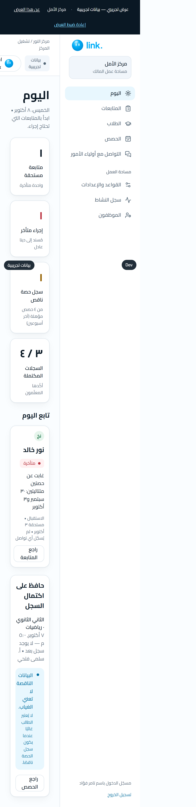
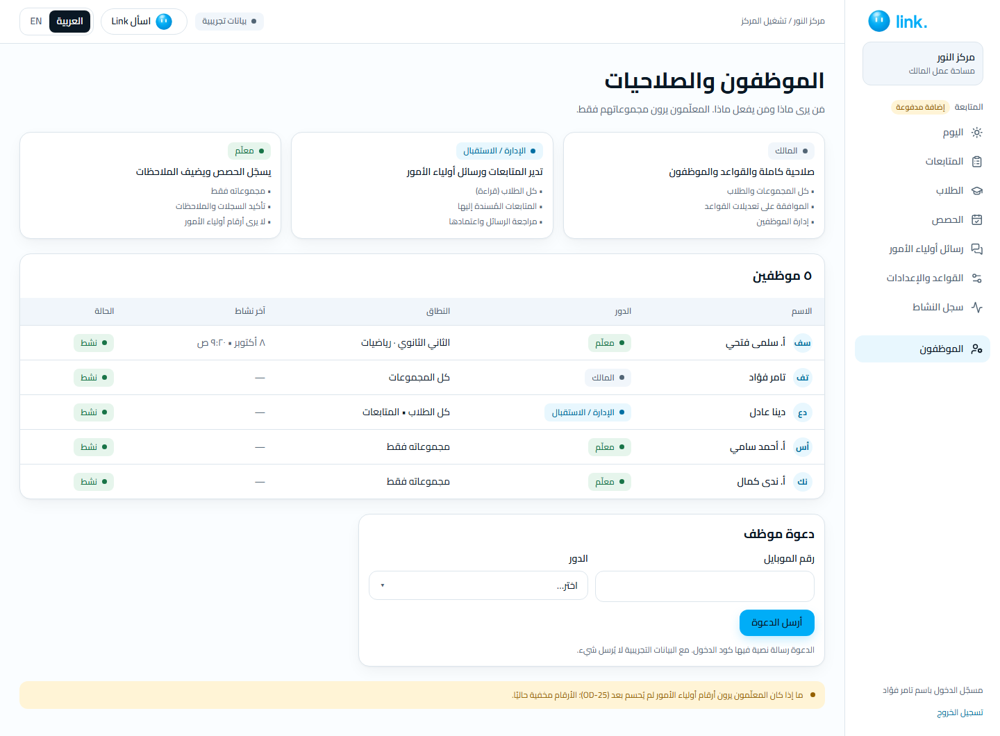

# App map

Every role → app → screen → status: the quickest way to find your way around. Product rules: [PRODUCT_BRIEF](../PRODUCT_BRIEF.md). Screen details and differences from Figma: [screen log](../frontend/screen-log.md). Figma inventory: [docs/11 §7](../11-design-system.md#7-screen-inventory).

"· Follow-up" marks a screen of the paid extra (on in the demo, OD-58). Thumbnails are the Arabic screenshots from the e2e runs. Run the demo with `pnpm demo`; every screen with one-click sign-in is at http://localhost:3000/ar/dev.

## Visitor: Website (`apps/web`, route group `(site)`)

4 of 4 built.

| ID | Screen | Route | Figma | Status | Screenshot |
|---|---|---|---|---|---|
| W00 | Landing page (copy of Figma) | `/{lang}` | [68:616](https://www.figma.com/design/3TteHvTvk9JrvUthg2AyE7/?node-id=68-616) | built |  |
| W-TRY | Try Link (becomes the role chooser, Step 2) | `/{lang}/try` | — | built |  |
| W-PILOT | Request a free pilot | `/{lang}/pilot` | — | built |  |
| W-SIGNIN | Sign in (pilot centres) | `/{lang}/sign-in` | — | built |  |

## Parent: Parent app (`apps/web`, mobile web)

10 of 10 built.

| ID | Screen | Route | Figma | Status | Screenshot |
|---|---|---|---|---|---|
| P01 | Welcome & sign up | `/{lang}/welcome` | [39:260](https://www.figma.com/design/3TteHvTvk9JrvUthg2AyE7/?node-id=39-260) | built |  |
| P02 | Search home | `/{lang}/search` | [39:334](https://www.figma.com/design/3TteHvTvk9JrvUthg2AyE7/?node-id=39-334) | built |  |
| P03 | Map & results | `/{lang}/search/results` | [40:261](https://www.figma.com/design/3TteHvTvk9JrvUthg2AyE7/?node-id=40-261) | built |  |
| P04 | Centre profile | `/{lang}/centres/[slug]` | [40:374](https://www.figma.com/design/3TteHvTvk9JrvUthg2AyE7/?node-id=40-374) | built |  |
| P05 | Teacher profile | `/{lang}/teachers/[slug]` | [42:262](https://www.figma.com/design/3TteHvTvk9JrvUthg2AyE7/?node-id=42-262) | built |  |
| P06 | Choose a group & start date | `/{lang}/teachers/[slug]/reserve` | [42:357](https://www.figma.com/design/3TteHvTvk9JrvUthg2AyE7/?node-id=42-357) | built |  |
| P07 | Reserve & pay | `/{lang}/reserve/[id]` | [43:264](https://www.figma.com/design/3TteHvTvk9JrvUthg2AyE7/?node-id=43-264) | built |  |
| P08 | Place reserved | `/{lang}/reserve/[id]/done` | [43:372](https://www.figma.com/design/3TteHvTvk9JrvUthg2AyE7/?node-id=43-372) | built |  |
| P09 | My children (+ approved updates with Follow-up) | `/{lang}/children` | [44:268](https://www.figma.com/design/3TteHvTvk9JrvUthg2AyE7/?node-id=44-268) | built |  |
| P10 | Leave feedback | `/{lang}/enrolments/[id]/feedback` | [44:362](https://www.figma.com/design/3TteHvTvk9JrvUthg2AyE7/?node-id=44-362) | built |  |

## Teacher: Teacher app (`apps/teacher-app`, Expo)

15 of 23 built.

| ID | Screen | Route | Figma | Status | Screenshot |
|---|---|---|---|---|---|
| T14 | Sign in (phone + code) | `/sign-in` | [23:237](https://www.figma.com/design/3TteHvTvk9JrvUthg2AyE7/?node-id=23-237) | to build (a demo one-click sign-in exists) | — |
| J01 | Find a room to rent | — | [59:358](https://www.figma.com/design/3TteHvTvk9JrvUthg2AyE7/?node-id=59-358) | to build | — |
| J02 | Request a room slot | — | [59:462](https://www.figma.com/design/3TteHvTvk9JrvUthg2AyE7/?node-id=59-462) | to build | — |
| J03 | My room requests | — | [51:341](https://www.figma.com/design/3TteHvTvk9JrvUthg2AyE7/?node-id=51-341) | to build | — |
| J04 | My teacher profile | — | [51:447](https://www.figma.com/design/3TteHvTvk9JrvUthg2AyE7/?node-id=51-447) | to build | — |
| J05 | My groups & fees | `/groups (read-only parts, with T09)` | [60:358](https://www.figma.com/design/3TteHvTvk9JrvUthg2AyE7/?node-id=60-358) | to build (fees and seats) | — |
| J06 | Enrolment requests | — | [60:452](https://www.figma.com/design/3TteHvTvk9JrvUthg2AyE7/?node-id=60-452) | to build | — |
| J07 | Earnings | — | [61:373](https://www.figma.com/design/3TteHvTvk9JrvUthg2AyE7/?node-id=61-373) | to build | — |
| T09 | My groups | `/groups` | [18:146](https://www.figma.com/design/3TteHvTvk9JrvUthg2AyE7/?node-id=18-146) | built |  |
| T01 | Today · Follow-up | `/today` | [7:183](https://www.figma.com/design/3TteHvTvk9JrvUthg2AyE7/?node-id=7-183) | built |  |
| T02 | Confirm attendance · Follow-up | `/record/[id]/attendance` | [7:209](https://www.figma.com/design/3TteHvTvk9JrvUthg2AyE7/?node-id=7-209) | built |  |
| T03 | Scores · Follow-up | `/record/[id]/scores` | [7:242](https://www.figma.com/design/3TteHvTvk9JrvUthg2AyE7/?node-id=7-242) | built |  |
| T04 | Observation · Follow-up | `/record/[id]/observation` | [7:272](https://www.figma.com/design/3TteHvTvk9JrvUthg2AyE7/?node-id=7-272) | built |  |
| V01 | Voice note · Follow-up | `/record/[id]/voice` | [34:237](https://www.figma.com/design/3TteHvTvk9JrvUthg2AyE7/?node-id=34-237) | built |  |
| V02 | What the AI understood · Follow-up | `/record/[id]/understood` | [34:327](https://www.figma.com/design/3TteHvTvk9JrvUthg2AyE7/?node-id=34-327) | built |  |
| T07 | Check the student · Follow-up | `/record/[id]/identity` | [8:130](https://www.figma.com/design/3TteHvTvk9JrvUthg2AyE7/?node-id=8-130) | built |  |
| T05 | Review before saving · Follow-up | `/record/[id]/review` | [7:294](https://www.figma.com/design/3TteHvTvk9JrvUthg2AyE7/?node-id=7-294) | built |  |
| T06 | Record saved · Follow-up | `/record/[id]/saved` | [7:317](https://www.figma.com/design/3TteHvTvk9JrvUthg2AyE7/?node-id=7-317) | built |  |
| T08 | Save failed · Follow-up | `/record/[id]/failed` | [8:152](https://www.figma.com/design/3TteHvTvk9JrvUthg2AyE7/?node-id=8-152) | built |  |
| T10 | Group roster · Follow-up | `/group/[id]` | [19:152](https://www.figma.com/design/3TteHvTvk9JrvUthg2AyE7/?node-id=19-152) | built |  |
| T11 | Note about a student · Follow-up | `/student/[id]/note` | [21:152](https://www.figma.com/design/3TteHvTvk9JrvUthg2AyE7/?node-id=21-152) | built |  |
| T12 | Student detail · Follow-up | `/student/[id]` | [22:154](https://www.figma.com/design/3TteHvTvk9JrvUthg2AyE7/?node-id=22-154) | built |  |
| T13 | Records history · Follow-up | `/group/[id]/history` | [23:156](https://www.figma.com/design/3TteHvTvk9JrvUthg2AyE7/?node-id=23-156) | built |  |

## Centre owner / staff: Centre web (`apps/web`, desktop)

17 of 27 built.

| ID | Screen | Route | Figma | Status | Screenshot |
|---|---|---|---|---|---|
| A18 | Owner sign-in | `/{lang}/centre` | [31:233](https://www.figma.com/design/3TteHvTvk9JrvUthg2AyE7/?node-id=31-233) | to build (a demo one-click sign-in exists) | — |
| C01 | Add my centre to Link | — | [45:273](https://www.figma.com/design/3TteHvTvk9JrvUthg2AyE7/?node-id=45-273) | to build | — |
| C02 | Public profile editor | — | [46:274](https://www.figma.com/design/3TteHvTvk9JrvUthg2AyE7/?node-id=46-274) | to build | — |
| C03 | Room schedule | — | [56:375](https://www.figma.com/design/3TteHvTvk9JrvUthg2AyE7/?node-id=56-375) | to build | — |
| C04 | Reviews & private feedback | — | [48:295](https://www.figma.com/design/3TteHvTvk9JrvUthg2AyE7/?node-id=48-295) | to build | — |
| C05 | Rooms & rent | — | [57:364](https://www.figma.com/design/3TteHvTvk9JrvUthg2AyE7/?node-id=57-364) | to build | — |
| C06 | Room requests | — | [49:307](https://www.figma.com/design/3TteHvTvk9JrvUthg2AyE7/?node-id=49-307) | to build | — |
| C07 | Rent income | — | [58:358](https://www.figma.com/design/3TteHvTvk9JrvUthg2AyE7/?node-id=58-358) | to build | — |
| A16 | Staff & access | `…/staff` | [29:215](https://www.figma.com/design/3TteHvTvk9JrvUthg2AyE7/?node-id=29-215) | built (marketplace roles: Step 2) |  |
| A01 | Today · Follow-up | `/{lang}/centre/[id]/today` | [5:2](https://www.figma.com/design/3TteHvTvk9JrvUthg2AyE7/?node-id=5-2) | built |  |
| A02 | Follow-ups · Follow-up | `…/follow-ups` | [5:83](https://www.figma.com/design/3TteHvTvk9JrvUthg2AyE7/?node-id=5-83) | built |  |
| A03 | Follow-up case · Follow-up | `…/follow-ups/[caseId]` | [5:153](https://www.figma.com/design/3TteHvTvk9JrvUthg2AyE7/?node-id=5-153) | built |  |
| V06 | Parent replied · Follow-up | `…/follow-ups/[caseId]/reply` | [36:284](https://www.figma.com/design/3TteHvTvk9JrvUthg2AyE7/?node-id=36-284) | built |  |
| A08 | Record outcome · Follow-up | `…/follow-ups/[caseId]/outcome` | [7:47](https://www.figma.com/design/3TteHvTvk9JrvUthg2AyE7/?node-id=7-47) | built |  |
| A10 | Outcome saved · Follow-up | `…/follow-ups/[caseId]/outcome/done` | [7:143](https://www.figma.com/design/3TteHvTvk9JrvUthg2AyE7/?node-id=7-143) | built |  |
| A13 | Students · Follow-up | `…/students` | [25:168](https://www.figma.com/design/3TteHvTvk9JrvUthg2AyE7/?node-id=25-168) | built |  |
| A04 | Student profile · Follow-up | `…/students/[studentId]` | [5:229](https://www.figma.com/design/3TteHvTvk9JrvUthg2AyE7/?node-id=5-229) | built |  |
| A05 | Sessions · Follow-up | `…/sessions` | [5:302](https://www.figma.com/design/3TteHvTvk9JrvUthg2AyE7/?node-id=5-302) | built |  |
| A14 | Session record · Follow-up | `…/sessions/[recordId]` | [26:178](https://www.figma.com/design/3TteHvTvk9JrvUthg2AyE7/?node-id=26-178) | built |  |
| A11 | Parent messages · Follow-up | `…/communication` | [15:79](https://www.figma.com/design/3TteHvTvk9JrvUthg2AyE7/?node-id=15-79) | built |  |
| A06 | Review parent message · Follow-up | `…/messages/[messageId]` | [5:367](https://www.figma.com/design/3TteHvTvk9JrvUthg2AyE7/?node-id=5-367) | built |  |
| A09 | Approved message · Follow-up | `…/messages/[messageId]` | [7:103](https://www.figma.com/design/3TteHvTvk9JrvUthg2AyE7/?node-id=7-103) | built |  |
| A07 | Rules & settings · Follow-up | `…/rules` | [5:423](https://www.figma.com/design/3TteHvTvk9JrvUthg2AyE7/?node-id=5-423) | built |  |
| A17 | Activity history · Follow-up | `…/activity` | [30:230](https://www.figma.com/design/3TteHvTvk9JrvUthg2AyE7/?node-id=30-230) | built |  |
| V07 | Ask Link (side panel) · Follow-up | every owner page | [38:250](https://www.figma.com/design/3TteHvTvk9JrvUthg2AyE7/?node-id=38-250) | built |  |
| A15 | Import students | — | [27:197](https://www.figma.com/design/3TteHvTvk9JrvUthg2AyE7/?node-id=27-197) | blocked (OD-21) | — |
| A19 | Centre setup: groups & teachers | — | [32:235](https://www.figma.com/design/3TteHvTvk9JrvUthg2AyE7/?node-id=32-235) | blocked (OD-21) | — |

## Link ops: Ops console (later, PRODUCT_BRIEF §5)

0 of 3 built.

| ID | Screen | Route | Figma | Status | Screenshot |
|---|---|---|---|---|---|
| L01 | Centre join requests & verification | — | [52:344](https://www.figma.com/design/3TteHvTvk9JrvUthg2AyE7/?node-id=52-344) | later | — |
| L02 | Review moderation | — | [53:355](https://www.figma.com/design/3TteHvTvk9JrvUthg2AyE7/?node-id=53-355) | later | — |
| L03 | Refunds & disputes | — | [53:445](https://www.figma.com/design/3TteHvTvk9JrvUthg2AyE7/?node-id=53-445) | later | — |
